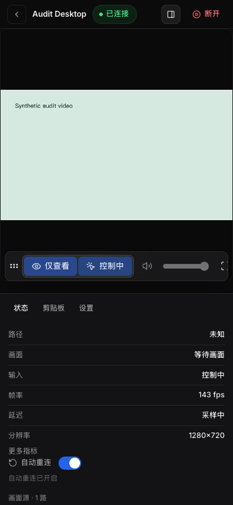
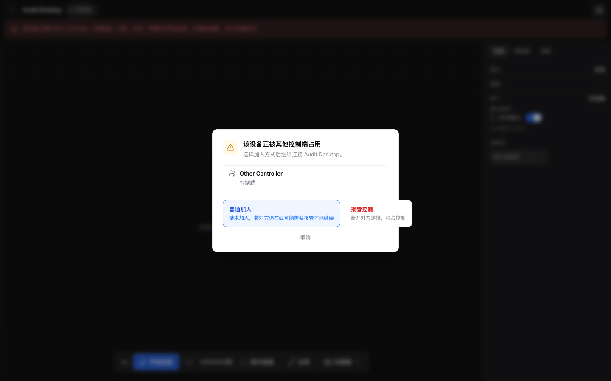

# UU Remote Web 项目审查

审查日期：2026-09-05（Asia/Shanghai）。代码基准：`811aa76903966758ece5c594c5fd9c1b9f36557a`。

本次检查覆盖 `shared/`、`backend/`、`cloudflare/`、`frontend/` 的主要调用路径，以及部署配置、CI、现有测试和用户文档。检查方式包括源码审查、完整测试、针对异常场景的临时测试，以及隔离浏览器中的桌面和移动端交互。

初始审查共记录 **26 项问题与工程风险：P1 3 项、P2 22 项、P3 1 项**，另有 **4 项待验证或待决策事项**。审查时优先处理项为信令服务器地址限制、Node 信令依赖漏洞和断线恢复；当时测试全部通过，多个异常流程缺少覆盖。

后续已完成上述 26 项及 R-03 资源限制的本地修改与验证，完整测试为 87 个文件、433 项成功，生产依赖扫描为 0 项已知漏洞。R-01 和 R-03 保留实机验证要求，R-02、R-04 等待产品决策。各项当前状态见 [修复记录](../implementation-notes.md)。

本文保留初始审查结论和模拟数据检查记录，源码链接的行号对应上述提交。后续修复状态、验证结果及待决策事项见 [修复记录](../implementation-notes.md)。审查和本地修复均未使用真实 UU 凭证、短信验证码或远端设备，未部署。

## 1. 严重程度与验证状态

| 级别 | 判定标准                                                                           |
| ---- | ---------------------------------------------------------------------------------- |
| P0   | 已确认可造成广泛严重损失、需要立即中止服务的问题。本次未确认此级别问题。           |
| P1   | 应优先修复的安全问题，或主要部署方式中会阻断核心流程的故障。触发前提在各项中说明。 |
| P2   | 特定流程、环境或时序下的功能错误，以及影响可靠性、可操作性的工程风险。             |
| P3   | 局部展示问题，对主流程的影响较小。                                                 |

验证状态分为：**已复现**（本地测试或真实浏览器操作确认）、**源码确认**（确定的实现缺口，运行影响受环境条件约束）、**依赖扫描**（版本命中公告，未执行攻击验证）。待验证事项单独列出，不计入上述 26 项。

## 2. 分类总表

| 类别                     |    P1 |     P2 |    P3 |   合计 |
| ------------------------ | ----: | -----: | ----: | -----: |
| 安全、会话隔离与数据保留 |     2 |      3 |     0 |      5 |
| 连接、协议与生命周期     |     1 |      8 |     0 |      9 |
| 账号与 API 错误处理      |     0 |      2 |     0 |      2 |
| 交互、移动端与无障碍     |     0 |      7 |     1 |      8 |
| 部署与测试保障           |     0 |      2 |     0 |      2 |
| **合计**                 | **3** | **22** | **1** | **26** |

| 编号                | 级别 | 问题                                           | 影响范围                           | 验证状态           |
| ------------------- | ---- | ---------------------------------------------- | ---------------------------------- | ------------------ |
| [SEC-01](#sec-01)   | P1   | 信令地址由调用者指定，Node 可访问任意回环地址  | Node；Worker 同样缺少目标限制      | 已复现 / 源码确认  |
| [SEC-02](#sec-02)   | P2   | 只读请求创建会话，容量满后驱逐活动连接         | Node 共享实例                      | 已复现             |
| [SEC-03](#sec-03)   | P2   | 带 opener 的新标签页继承原会话标识             | 两种部署的浏览器会话               | 已复现             |
| [SEC-04](#sec-04)   | P2   | 信令事件保留期限依赖后续访问，静置数据持续留存 | Worker / Durable Object            | 源码确认           |
| [SEC-05](#sec-05)   | P1   | Node 信令解析依赖命中高危拒绝服务公告          | Node；其他依赖需按调用路径评估     | 依赖扫描           |
| [CON-01](#con-01)   | P2   | 浏览器后退或卸载页面未完成网关和房间清理       | 两种部署                           | 已复现             |
| [CON-02](#con-02)   | P1   | 网关断开后停止轮询，并阻止自动重连             | Worker 尤为明显；Node 状态也受影响 | 已复现 / 源码确认  |
| [CON-03](#con-03)   | P2   | 重连过程清零次数，退避和中转升级无法累计       | 前端恢复逻辑                       | 已复现             |
| [CON-04](#con-04)   | P2   | 旧轮询结果可覆盖重置后的事件和会话状态         | 两种部署，Node 事件游标影响更大    | 已复现             |
| [CON-05](#con-05)   | P2   | 首次媒体协商没有完成期限                       | 所有远控连接                       | 源码确认           |
| [CON-06](#con-06)   | P2   | 自动路由覆盖服务端的强制中转要求               | 所有远控连接                       | 源码及现有测试确认 |
| [CON-07](#con-07)   | P2   | Worker 未检测 Engine.IO 心跳超时               | Worker 信令连接                    | 已复现             |
| [CON-08](#con-08)   | P2   | 上游超时只覆盖响应头，未覆盖响应体             | 两种网关的 UU 代理                 | 已复现 / 源码确认  |
| [CON-09](#con-09)   | P2   | 远程协助控制页刷新后显示设备不存在             | 远程协助                           | 已复现             |
| [AUTH-01](#auth-01) | P2   | HTTP 和业务失败被解释为空列表或成功            | 登录、设备列表、房间释放           | 已复现             |
| [AUTH-02](#auth-02) | P2   | 异常 JWT 写入后可使应用持续空白                | 凭证导入及页面启动                 | 已复现             |
| [UX-01](#ux-01)     | P2   | 接管弹窗确认后首次请求仍为普通加入             | 被其他控制端占用的设备             | 已复现             |
| [UX-02](#ux-02)     | P2   | 移动端工具栏截断且无法触摸横向滚动             | 窄屏触控设备                       | 已复现             |
| [UX-03](#ux-03)     | P2   | 命令面板 Enter 无视当前焦点，选择首台设备      | 键盘操作                           | 已复现             |
| [UX-04](#ux-04)     | P2   | 模态弹窗缺少焦点进入、限制和恢复               | 键盘及辅助技术用户                 | 已复现 / 源码确认  |
| [UX-05](#ux-05)     | P3   | 接管弹窗按钮超出弹窗边界                       | 桌面弹窗                           | 已复现             |
| [UX-06](#ux-06)     | P2   | 全屏提示支持 Esc，但按键无法退出               | 全屏远控                           | 已复现             |
| [UX-07](#ux-07)     | P2   | 按设备 ID 直连遇到验证码要求后无法继续         | 设备列表快捷协助                   | 已复现             |
| [UX-08](#ux-08)     | P2   | 移动端缺少可唤起软键盘的文字输入入口           | 移动端；本地 IME 输入路径          | DOM / 源码确认     |
| [OPS-01](#ops-01)   | P2   | Docker 文档缺少浏览器安全上下文前提            | 通过 LAN 地址或普通 HTTP 域名访问  | 已复现             |
| [OPS-02](#ops-02)   | P2   | 推荐部署的入口、DO 存储和生命周期缺少集成测试  | Worker 交付保障                    | 源码确认           |

## 3. 安全、会话隔离与数据保留

### SEC-01 · P1 · 信令服务器地址缺少限制

**触发与结果：** 调用者向 `/api/remote/signal/start` 提交任意非空 `roomConfig.token`、自定义 `signalServers` 和格式合格的 `X-UURC-Session`。校验仅检查字符串类型，随后网关直接建立连接。本地诊断使用临时回环 HTTP 监听器，确实收到 Node 发出的 `/socket.io/?EIO=4&transport=websocket` 请求，全程只使用合成数据。

**影响：** 能访问该 API 的调用者可驱动 Node 向其所在网络发起 HTTP/WebSocket 握手，构成 SSRF；可用于探测内网端口，或连接攻击者控制的信令服务。请求方式和路径受 Socket.IO 限制，本次仅确认请求到达回环监听器。Worker 的地址校验同样缺失，其具体可达范围还受 Cloudflare 平台限制，未验证 Worker 内网访问。

**位置：** [requests.ts:100](../shared/src/signalGateway/requests.ts#L100)、[remote.ts:17](../backend/src/routes/remote.ts#L17)、[socketIoSignalGatewayConnector.ts:17](../backend/src/services/socketIoSignalGatewayConnector.ts#L17)、[socketIoWire.ts:18](../cloudflare/src/signal/socketIoWire.ts#L18)。

**建议与验收：** 明确信令目标的允许域名、协议和端口，并在两种网关统一执行。Node 还应约束解析后的目标 IP、重定向及 DNS 变化，限制内网、回环和链路本地地址。测试应确认被拒绝的目标没有产生出站请求。公网访问控制仍按现有安全文档部署；获得站点访问权限后也需要上述出站限制。

### SEC-02 · P2 · 状态查询可以驱逐其他活动会话

**触发与结果：** `/remote` 中间件对所有请求执行 `getOrCreate`，包括状态、事件和诊断查询。会话上限默认 64，达到上限后驱逐最近最少访问的记录，未检查该记录是否仍有活动连接。将测试上限设为 2，建立一个连接后创建两个只读访问者，会关闭原连接。

**影响：** 能访问共享 Node API 的调用者持续更换随机会话标识，即可消耗容量并中断其他人的连接；正常的多标签页和多用户访问也可能触发。随机标识由客户端自行生成，服务端未要求先创建受配额约束的会话。

**位置：** [remote.ts:24](../backend/src/routes/remote.ts#L24)、[remoteControlSessionRegistry.ts:35](../backend/src/services/remoteControlSessionRegistry.ts#L35)。

**建议与验收：** 查询只读取已有会话；只有连接操作分配资源。容量不足时返回明确错误，优先清理过期空闲记录，对会话创建设置配额。测试应在容量耗尽时确认已有远控保持连接。

### SEC-03 · P2 · 新标签页可能复用原信令会话

**触发与结果：** `getRemoteSessionId()` 优先读取 `sessionStorage`。浏览器通过带 opener 的 `window.open` 创建同源标签页时，会复制初始 sessionStorage。本次浏览器检查确认父、子页面的 `uurc.remoteSessionId` 均存在且完全相同。

**影响：** 两个页面访问同一 Node 会话或同一 DO；其中一个页面开始、停止连接，可能影响另一个页面。普通独立打开的标签页会生成新标识，本次复现范围为带 opener 的新页面；浏览器菜单中的复制标签页尚未逐浏览器测试。

**位置：** [remoteSession.ts:6](../frontend/src/api/remoteSession.ts#L6)、[index.ts:104](../cloudflare/src/index.ts#L104)。

**建议与验收：** 明确刷新恢复和跨标签页隔离的关系。可在页面间检测活动标识冲突，出现冲突时为新页面重建会话；项目主动打开的窗口应使用 `noopener`。验收覆盖独立新建、带 opener 新建、复制标签页和原页面刷新，并检查两个页面的 start/stop 互不影响。

### SEC-04 · P2 · 静置的 DO 信令记录超过保留期限仍留在存储中

**触发与结果：** `SIGNAL_GATEWAY_EVENT_RETENTION_MS` 为 15 分钟，但 SQLite 清理仅发生在 `readEvents()` 和 `recordEvent()` 中。用户离开后，如果没有后续读取或事件写入，超期行继续保留。显式 stop 会清空事件；被动断线回调只更新状态，没有定时清理或 alarm。

**影响：** 持久化的原始信令可包含 SDP、ICE 地址及控制响应中的临时连接参数。静置会话的实际保存时间超过代码常量表达的期限，增加数据留存和存储管理负担。后续 API 读取会先清理过期数据，本项关注数据库中的实际保留时间。

**位置：** [status.ts:15](../shared/src/signalGateway/status.ts#L15)、[signalSessionStore.ts:47](../cloudflare/src/signal/signalSessionStore.ts#L47)、[signalSessionStore.ts:71](../cloudflare/src/signal/signalSessionStore.ts#L71)、[signalSession.ts:230](../cloudflare/src/signalSession.ts#L230)。

**建议与验收：** 为敏感临时事件建立明确的删除期限，使用 DO alarm 或等效服务端清理；按协议消费需要保留必要字段。测试写入后停止所有访问，跨过期限后直接检查存储内容。此次未连接线上 DO 数据库，未测实际线上保留时长。

### SEC-05 · P1 · Node 信令依赖命中高危公告

**扫描结果：** `npm audit --omit=dev` 返回 7 个受影响依赖条目，其中 3 个 high、4 个 moderate；条目包含依赖链传播，多个条目可能对应同一公告。锁文件中 `socket.io-parser` 为 4.2.6，`engine.io-client` 下的 `ws` 为 8.18.3。

**影响：** Node 实际使用这条 Socket.IO/WebSocket 调用路径。恶意信令对端可触达相关解析器；SEC-01 又允许调用者指定对端，进一步扩大触发范围。未执行内存耗尽攻击，也未确认实例已遭受利用。

| 依赖与公告                                                                                    | 本项目判断                                                                                                                          |
| --------------------------------------------------------------------------------------------- | ----------------------------------------------------------------------------------------------------------------------------------- |
| `socket.io-parser` · [GHSA-2m8v-j782-fhvr](https://github.com/advisories/GHSA-2m8v-j782-fhvr) | Zero-attachment Memory Exhaustion，实际 Node 信令路径使用；公告修复范围为 4.2.7 及以上。                                            |
| `ws` · [GHSA-96hv-2xvq-fx4p](https://github.com/advisories/GHSA-96hv-2xvq-fx4p)               | 微小分片导致内存耗尽，Node 上游连接使用；公告修复范围为 8.21.0 及以上。另命中较低级别的内存披露公告。                               |
| `react-router` 7.15.1                                                                         | 命中路由匹配、重定向、SSR/RSC 等公告。本项目主要采用 BrowserRouter 和静态页面，SSR/RSC 特有触发条件尚未确认，单独保留版本升级任务。 |
| `qs`、`express`、`body-parser`、`engine.io-client`                                            | 含直接公告和传递依赖条目，需按实际参数和调用方式核对。此次未确认 qs 特定 stringify/parse 配置的触发路径。                           |

**位置：** [package-lock.json](../package-lock.json)、[socketIoSignalGatewayConnector.ts:1](../backend/src/services/socketIoSignalGatewayConnector.ts#L1)。完整扫描快照见 [dependencies.json](audit-assets/2026-09-05/dependencies.json)。

**建议与验收：** 优先更新 Node 信令依赖并刷新锁文件，复测握手、二进制互操作、ACK、断线恢复。重新执行生产依赖扫描，逐项解释仍保留的公告及其触发条件。

## 4. 连接、协议与生命周期

### CON-01 · P2 · 页面退出清理未覆盖浏览器导航

**触发与结果：** 已开始远控后使用浏览器后退，或直接卸载控制页。组件 cleanup 关闭本地 RTCPeerConnection，未调用 DELETE 信令接口，也未清理 UU 房间或取消协助。临时组件测试和浏览器请求记录均确认此结果。显式返回按钮有另一套清理流程。

**影响：** 网关连接和远端占用可能继续存在，重新进入时可能遇到自身占用；Node 的一小时空闲 TTL 也仅在下一次 `getOrCreate()` 时处理。模拟时间越过 TTL、且无新请求时，旧连接仍保持打开。Worker 缺少客户端活动期限，具体存活时间依赖平台和上游。

**位置：** [useBrowserRemoteSessionController.ts:30](../frontend/src/controllers/useBrowserRemoteSessionController.ts#L30)、[useRemoteControlController.ts:254](../frontend/src/controllers/useRemoteControlController.ts#L254)、[remoteControlSessionRegistry.ts:59](../backend/src/services/remoteControlSessionRegistry.ts#L59)。

**建议与验收：** 在 SPA 离开控制页时统一执行可重复调用的清理；页面关闭、崩溃和网络断开还需服务端客户端活动期限兜底。清理范围包含浏览器 peer、信令连接及房间释放或协助取消。分别测试返回按钮、浏览器后退、刷新、关闭标签页和异常断网，确认没有持续占用。

### CON-02 · P1 · 网关断开后自动恢复停止

**触发与结果：** 前端诊断读到网关 `closed/error` 后，轮询 effect 因 `gatewayActive=false` 停止；重连 hook 又要求 `signalGatewayMatchesRoom=true`。这个字段包含网关必须 connected 的判断。临时测试设置已有房间、控制通道关闭、网关断开，推进 60 秒，重连回调次数为 0。

**影响：** 推荐的 Worker 部署在上游 WebSocket 断开后，只会更新状态，没有主动重建连接，用户需手动恢复。Node 虽有 Socket.IO 重连，前端一旦停止轮询也无法及时观察网关恢复，后续信令和连接统计随之停止更新。此故障会影响断网、网络切换和上游重启后的连续使用。

**位置：** [useRemoteRecoveryController.ts:43](../frontend/src/controllers/useRemoteRecoveryController.ts#L43)、[useSignalGatewayController.ts:63](../frontend/src/controllers/useSignalGatewayController.ts#L63)、[useRemoteControlController.ts:383](../frontend/src/controllers/useRemoteControlController.ts#L383)、[signalSession.ts:230](../cloudflare/src/signalSession.ts#L230)。

**建议与验收：** 将网关重新连接纳入恢复流程，网关断开期间仍保留有节制的状态检查。明确 Node 和 Worker 各自负责的恢复步骤，防止同时重复发起连接。模拟两种网关连接后断线并恢复，要求在约定时间内自动恢复画面和输入，且用户主动停止后保持停止。

### CON-03 · P2 · 重连次数在重建连接时清零

**触发与结果：** `canRecover` 只在浏览器 stage 为 connected 且通道或视频异常时成立。重连入口先关闭浏览器会话，使 stage 回到 idle；hook 随即将 attemptCount 清零。模拟两轮 connected 异常、idle、connected 异常，回调参数为 `[0, 0]`。

**影响：** 900ms 到 5s 的退避无法持续累计；`attemptCount >= 2` 才启用的强制中转升级通常无法达到，界面上的次数也难以反映连续失败。

**位置：** [useRemoteRecoveryController.ts:33](../frontend/src/controllers/useRemoteRecoveryController.ts#L33)、[useRemoteControlController.ts:307](../frontend/src/controllers/useRemoteControlController.ts#L307)。

**建议与验收：** 仅在连接稳定恢复、用户主动停止或切换目标时重置恢复次数。测试应通过实际重连入口经历 idle/offered 阶段，检查连续失败次数增长、间隔增加及约定次数后的中转策略。

### CON-04 · P2 · 已重置的会话仍接收旧轮询结果

**触发与结果：** `refreshSignalEvents()` 发起请求后没有会话版本检查或取消机制。轮询 effect 的 `stopped` 仅影响下一次请求及错误提示，未保护成功响应。将旧请求延迟，调用 reset 后再返回 event id 100，事件列表会重新出现该旧事件。

**影响：** 旧请求可重新写入诊断、游标和已关闭 peer 的状态。Node start 会清空事件并重新从低编号产生事件，旧结果把游标推进至 100 后，新会话的 answer/candidate 可能在后续 `after=100` 查询中被跳过。Worker 使用 SQLite 自增 ID，仍受旧状态覆盖影响。

**位置：** [useSignalGatewayController.ts:29](../frontend/src/controllers/useSignalGatewayController.ts#L29)、[useSignalGatewayController.ts:41](../frontend/src/controllers/useSignalGatewayController.ts#L41)、[remoteControlService.ts:108](../backend/src/services/remoteControlService.ts#L108)。

**建议与验收：** 为每次会话重置增加版本标识，响应提交前校验会话与 peer 是否仍有效；支持取消正在进行的请求。测试让旧响应分别在 reset、新 start 和 unmount 后返回，确认其不能写入任何新会话状态或推进游标。

### CON-05 · P2 · 首次媒体协商可无限等待

**触发与结果：** control ACK 成功、offer 发出后，如果远端始终不返回 answer，浏览器状态留在 offered。代码没有针对协商完成的截止时间，主操作显示禁用的等待画面；自动恢复仅处理 connected 阶段。

**影响：** 用户长期看不到画面，也没有直接可用的重试主操作，只能断开后重新开始。信令连接成功和 control ACK 成功都无法保证媒体协商完成。

**位置：** [browserRemoteSession.ts:308](../frontend/src/remote/browserRemoteSession.ts#L308)、[remoteSessionUiModel.ts:45](../frontend/src/remote/remoteSessionUiModel.ts#L45)、[useRemoteRecoveryController.ts:33](../frontend/src/controllers/useRemoteRecoveryController.ts#L33)。

**建议与验收：** 为首次 answer、连接建立和首帧等待分别设置合理期限，超时后展示可重试状态并释放旧 peer。测试覆盖无 answer、answer 无有效 candidate，以及通道打开但无首帧；延迟结果不得覆盖下一次尝试。此次通过源码确认，未使用真实远端制造协商故障。

### CON-06 · P2 · 自动路由丢弃服务端 forceRelay

**触发与结果：** 服务端 control result 返回 `forceRelay=true`，用户保持自动路由。调用方将未传入的覆盖值转换为 `input.forceRelay === true`，即 false；共享配置构造函数优先使用该 false，最终创建 `iceTransportPolicy: "all"`。

**影响：** 浏览器实际连接策略与服务端要求及诊断展示不一致。要求中转的场景仍可能尝试直连。现有测试名称为 `respects service-requested relay...`，断言却期待 `all`，已固化当前行为。

**位置：** [browserRemoteSession.ts:266](../frontend/src/remote/browserRemoteSession.ts#L266)、[signalControl.ts:90](../shared/src/streamer/signalControl.ts#L90)、[app.remoteLifecycle.test.tsx:146](../frontend/tests/app.remoteLifecycle.test.tsx#L146)。

**建议与验收：** 保留 undefined 的含义，明确服务端要求与用户选择的优先级。覆盖服务端 true/false/缺省与用户 auto/relay 的组合，同时核对 RTCConfiguration、诊断文字和实际 candidate 类型。

### CON-07 · P2 · Worker 忽略心跳超时参数

**触发与结果：** Engine.IO open 包带有 `pingInterval/pingTimeout`，Worker 只取 sid。收到 ping 时会回复 pong，持续收不到 ping 时没有超时处理。模拟握手约定 1 秒间隔和 1 秒超时，之后没有消息、没有底层 close，推进 60 秒后仍为 connected。

**影响：** 半开连接可能持续被报告为可用，ACK 和媒体恢复在后续请求失败时才有机会触发。Node 采用的 Engine.IO 客户端具有心跳超时机制，两种部署行为存在差异。

**位置：** [workerSignalSocket.ts:198](../cloudflare/src/signal/workerSignalSocket.ts#L198)、[socketIoWire.ts:29](../cloudflare/src/signal/socketIoWire.ts#L29)。

**建议与验收：** 读取并校验心跳参数，按协议维护超时计时器，在 close、重连和握手失败时清理。测试正常续期、遗漏心跳、异常参数和旧连接定时器，确认超时会关闭连接并更新网关状态。

### CON-08 · P2 · UU 代理的超时在读取响应体前已取消

**触发与结果：** 两种代理均在 `await fetch()` 返回后立即 clearTimeout，随后才 `await response.text()`。fetch 返回时响应体可能仍在传输。本地测试控制响应头先到、正文保持 pending，确认 30 秒 AbortController 计时器已被清除。

**影响：** 慢速或不结束的正文不再受项目定义的 30 秒期限约束；前端 fetch 也未设置自身期限，用户操作可能长时间停留在 busy。底层运行时可能有其他超时，其值和行为未由本项目统一保证。

**位置：** [proxy.ts:46](../backend/src/routes/proxy.ts#L46)、[index.ts:63](../cloudflare/src/index.ts#L63)、[localProxyTransport.ts:11](../frontend/src/transport/localProxyTransport.ts#L11)。

**建议与验收：** 将正文读取和解析纳入同一请求期限，并限制响应体大小；为前端操作提供超时和取消状态。测试响应头及时返回但正文停顿、持续慢速正文、取消及重试。

### CON-09 · P2 · 远程协助页面刷新后丢失目标上下文

**触发与结果：** 协助加入结果通过 `useProductController` 的内存 handoff 传入控制页。`useRoomController` 仅从 handoff 初始化；刷新后 handoff 丢失，没有从已保存的 room session 恢复。浏览器中成功加入模拟伙伴后刷新，sessionStorage 仍有房间数据，页面显示设备不存在。

**影响：** 伙伴通常不在当前账号的自有设备列表中，因此控制页无法解析目标；用户需要重新发起协助，可能再次要求伙伴确认。原信令和房间的遗留清理同时受 CON-01 影响。

**位置：** [useProductController.ts:38](../frontend/src/controllers/useProductController.ts#L38)、[useProductController.ts:245](../frontend/src/controllers/useProductController.ts#L245)、[useRoomController.ts:8](../frontend/src/controllers/useRoomController.ts#L8)、[roomSessionStore.ts:92](../frontend/src/uu/roomSessionStore.ts#L92)。

**建议与验收：** 明确协助刷新策略：校验现有上下文后恢复，或清理后引导重新确认。上下文至少需绑定账号、目标、加入类型和时效。测试自有设备、伙伴设备、过期房间和账号切换后的刷新结果。

## 5. 账号与 API 错误处理

### AUTH-01 · P2 · 上游失败被显示为空设备或成功

**已复现的两条路径：**

- 设备接口返回 HTTP 401 及业务错误，`getDeviceGroups()` 正常 resolve 为空分组；真实浏览器显示暂无设备，登录过期提示缺失。
- 网关返回 HTTP 500、正文为 `{ "error": "upstream timeout" }`，`sendMobileCode()` 仍正常 resolve；上层随后显示验证码已发送并启动 60 秒倒计时。

**原因与影响：** transport 返回错误状态但调用方没有统一判错。账号接口的 `assertUpstreamOk()` 只处理数字类型且非零的 body.code；设备归一化也未先检查失败。房间释放逻辑同样只看 code，HTTP 错误且 code 缺省时可能更新为已释放状态。用户会收到错误的空状态或成功提示，重复尝试也缺少方向。

**位置：** [localProxyTransport.ts:19](../frontend/src/transport/localProxyTransport.ts#L19)、[accountApi.ts:114](../frontend/src/uu/accountApi.ts#L114)、[roomApi.ts:9](../frontend/src/uu/roomApi.ts#L9)、[useProductController.ts:144](../frontend/src/controllers/useProductController.ts#L144)、[remoteRoomLifecycle.ts:117](../frontend/src/controllers/remoteRoomLifecycle.ts#L117)。

**建议与验收：** 分别校验代理 HTTP 状态、上游 HTTP 状态、业务结果及必要字段；为等待确认等合法非零业务码保留明确处理分支。401/403 引导重新登录，网络失败显示可重试错误。覆盖 JSON/HTML 错误、code 缺省、异常结构和真正的空设备列表。

### AUTH-02 · P2 · 异常 JWT 导致持久化的启动崩溃

**触发与结果：** JWT payload 可解码为 JSON null，或 exp 为超出 Date 表示范围的数字。`decodeJwtPayload` 将解析结果直接断言为对象，`summarizeAuthState` 访问 exp 或调用 toISOString 时抛错。导入路径先写 localStorage，随后才生成状态摘要。

**影响：** 用户误导入异常凭证后，刷新仍会在根组件初始化时抛错。隔离浏览器预置 `header.bnVsbA.signature` 后访问登录页，body 为空，捕获到 `Cannot read properties of null (reading 'exp')`。超大 exp 的异常由临时测试确认。用户无法通过页面正常清除这些凭证。

**位置：** [authState.ts:24](../shared/src/authState.ts#L24)、[authState.ts:39](../shared/src/authState.ts#L39)、[loginStateStore.ts:27](../frontend/src/uu/loginStateStore.ts#L27)、[App.tsx:35](../frontend/src/App.tsx#L35)。

**建议与验收：** 在持久化前校验解析类型和 exp 范围；读取已有存储时能够恢复为可操作的登录状态。根组件增加可清除异常本地状态的错误恢复入口。测试 null、数组、异常 exp、损坏存储，以及失败导入后刷新。

## 6. 交互、移动端与无障碍

### UX-01 · P2 · 接管确认的首次请求使用旧状态

**触发与结果：** 设备已被其他控制端占用，打开弹窗后点击接管控制。`resolveOccupiedDialog(true)` 先调用 setForceJoin，再立即调用当前渲染中的 onNextAction。后者仍读取旧 forceJoin。测试和浏览器均观察到 `force_join: false`，且没有发起 signal/start。

**影响：** 用户已明确选择接管，系统仍执行普通加入，需要再操作一次才能继续，容易被理解为连接失败。

**位置：** [RemoteControlPage.tsx:60](../frontend/src/components/RemoteControlPage.tsx#L60)、[useRemoteControlController.ts:343](../frontend/src/controllers/useRemoteControlController.ts#L343)。

**建议与验收：** 将本次确认的 force 参数直接传入连接动作，减少动作对尚未提交的 React state 的依赖。验收普通加入和接管两个按钮各点击一次后，首个请求参数和后续连接流程均符合选择。

### UX-02 · P2 · 移动端工具栏无法触摸横向滚动

**触发与结果：** 390×844 触控视口中，工具栏可见宽度 372px，内容宽度 662px。CSS 设置 `overflow-x: auto`，同时继承自身的 `touch-action: none`。通过 Chrome DevTools Protocol 发送真实触摸滑动，scrollLeft 始终为 0；临时仅将 touch-action 改为 pan-x 后，同样动作移动至 290。

**影响：** 全屏、部分画面模式和快捷键入口超出右侧可见范围，触屏用户无法沿工具栏访问。页面整体宽度正常，问题集中在工具栏。检查未使用真实手机硬件。

**位置：** [control-command-bar.css:25](../frontend/src/styles/control-command-bar.css#L25)、[responsive.css:94](../frontend/src/styles/responsive.css#L94)。

**建议与验收：** 将拖拽手柄的触摸规则与工具栏滚动区域分开，在窄屏允许横向平移。320px、390px 和横屏视口中，使用触摸操作访问每个按钮，同时验证工具栏拖拽功能。

### UX-03 · P2 · 命令面板 Enter 选择首台设备

**触发与结果：** 命令面板容器捕获所有冒泡的 Enter，只要存在 firstMatch 就 preventDefault 并选择首个设备。本次将焦点移至刷新设备列表按钮，按 Enter 后跳转到第一台模拟设备的控制页。

**影响：** 键盘用户尝试刷新、选择后续设备或执行其他操作时可能打开错误目标。默认自动连接开启时，还可能继续发起对该设备的连接。

**位置：** [CommandPalette.tsx:56](../frontend/src/components/CommandPalette.tsx#L56)、[useRemoteControlPreferences.ts:45](../frontend/src/controllers/useRemoteControlPreferences.ts#L45)。

**建议与验收：** 将输入框快捷提交限定在输入框，或实现具有明确当前选项的命令列表。原生按钮获得焦点时应按其自身命令执行。检查 Tab、Shift+Tab、方向键、Enter 和 Escape，逐项确认执行目标。

### UX-04 · P2 · 模态弹窗缺少焦点管理

**触发与结果：** 通用 Dialog 设置 role=dialog 和 aria-modal，却未在打开时移动焦点、限制 Tab 范围、禁用背景或恢复关闭前的焦点。浏览器打开接管弹窗后，document.activeElement 仍是后方的开始连接按钮。

**影响：** 键盘操作可能继续作用于被遮挡的页面，屏幕阅读器用户也难以定位当前确认步骤。命令面板另有实现，虽然尝试聚焦输入框，同样缺少完整的焦点约束。

**位置：** [Dialog.tsx:22](../frontend/src/components/ui/Dialog.tsx#L22)、[Dialog.tsx:73](../frontend/src/components/ui/Dialog.tsx#L73)、[CommandPalette.tsx:27](../frontend/src/components/CommandPalette.tsx#L27)。

**建议与验收：** 使用符合模态行为的原生 dialog 或成熟组件，补齐初始焦点、循环焦点、背景不可交互和关闭后恢复。当前 Dialog 中的 inert 只用于退出动画期间的弹窗自身。验收包含纯键盘全流程及至少一种屏幕阅读器；本次未运行屏幕阅读器实测。

### UX-05 · P3 · 接管弹窗按钮溢出

**触发与结果：** 1440×900 视口下，动画完成后的弹窗 clientWidth 为 438px、scrollWidth 为 470px，接管按钮右侧超出容器约 31px。全局 button 的 `white-space: nowrap` 与两列 `1fr 1fr` 布局叠加，使长说明撑大按钮。

**影响：** 选项的布局和边界不完整，放大文字后可能加重。

**位置：** [base.css:112](../frontend/src/styles/base.css#L112)、[panel.css:340](../frontend/src/styles/panel.css#L340)。

**建议与验收：** 允许说明文字换行，使用允许收缩的网格列并检查按钮最小宽度。覆盖桌面、窄屏、长设备名与 200% 页面缩放。

### UX-06 · P2 · Esc 无法退出页面全屏

**触发与结果：** 全屏由 React 布尔状态和 CSS 类实现，页面显示 Esc 退出全屏。代码没有对应 Escape 状态切换。浏览器点击全屏再按 Escape，`control-stage-frame--fullscreen` 仍存在。

**影响：** 用户无法按提示退出；远控画面聚焦且输入开启时，Escape 还可能被发送给远端。移动端工具栏访问又受 UX-02 影响。

**位置：** [useRemoteInputController.ts:473](../frontend/src/controllers/useRemoteInputController.ts#L473)、[RemoteControlPage.tsx:117](../frontend/src/components/RemoteControlPage.tsx#L117)。

**建议与验收：** 明确 Escape 在全屏、本地弹窗和远端输入之间的优先级，实现对应退出行为。测试工具栏显示、自动隐藏、焦点在远控画面和弹窗打开时的 Escape。

### UX-07 · P2 · 设备 ID 快捷协助遇到验证码后中断

**触发与结果：** 设备列表仅提供设备 ID 输入框，却直接执行完整协助流程。伙伴为 by_password 模式、当前没有验证码时，页面显示伙伴设备当前要求输入设备验证码，仍停留在 `/devices`，页面只有一个输入框，无法填写所需验证码。

**影响：** 常见的密码验证协助无法通过该入口完成，用户必须自己找到远控伙伴页。若用户先前在伙伴页填写过验证码，快捷入口还会读取留在全局控制器中的旧值。

**位置：** [DeviceListPage.tsx:47](../frontend/src/components/DeviceListPage.tsx#L47)、[useProductController.ts:197](../frontend/src/controllers/useProductController.ts#L197)、[useProductController.ts:218](../frontend/src/controllers/useProductController.ts#L218)。

**建议与验收：** 查询到需要验证码后，携带设备 ID 进入可填写验证码的协助页面，或在当前流程提供该字段；目标变化时处理旧验证码。覆盖密码、对方确认、二次确认三种模式。

### UX-08 · P2 · 移动端缺少文字输入入口

**已确认的实现：** 远控区域是可聚焦 div，没有 input、textarea 或 contenteditable。触控视口的 DOM 检查确认可编辑元素数量为 0。键盘控制只转发 keydown/keyup，`isComposing` 时直接返回，页面没有 compositionend 或文本提交处理。

**影响范围：** 当前入口依赖物理键盘事件或剪贴板，手机用户无法通过聚焦普通 div 唤起常规软键盘。本地中文 IME 的组合结果也缺少提交路径。远端自身输入法配合物理键盘仍可能正常工作。iOS/Android 真实软键盘、中文输入法和外接键盘行为未实测。

**位置：** [RemoteControlStage.tsx:83](../frontend/src/components/RemoteControlStage.tsx#L83)、[useRemoteInputController.ts:296](../frontend/src/controllers/useRemoteInputController.ts#L296)。

**建议与验收：** 增加明确的文本输入操作和可唤起软键盘的输入元素，组合输入完成后通过已有文本协议发送。实机覆盖中文、英文、换行、空格、删除及剪贴板，确认不会重复发送物理键盘和文本事件。

## 7. 部署与测试保障

### OPS-01 · P2 · Docker 访问说明缺少 HTTPS 前提

**触发与结果：** Docker 示例发布普通 HTTP 8787 端口。用户经 LAN IP 或普通 HTTP 域名访问时，浏览器通常将其视为非安全上下文，`crypto.subtle` 不可用，签名函数直接抛错。此次通过隔离浏览器把测试域名请求转发到本地服务，确认 `isSecureContext=false`、`crypto.subtle` 缺失，设备页显示 `Web Crypto is unavailable in this browser`。

**影响：** 自部署后的登录、设备加载和签名请求无法进行。localhost/回环地址有浏览器安全上下文例外，本机开发测试容易遗漏这个部署条件。

**位置：** [compose.yml:6](../compose.yml#L6)、[README.zh-CN.md:47](../README.zh-CN.md#L47)、[README.md:47](../README.md#L47)、[signing.ts:95](../frontend/src/uu/signing.ts#L95)。

**建议与验收：** 双语部署文档说明 HTTPS 或安全上下文要求，提供反向代理和证书配置入口；前端启动时给出可理解的环境提示。验收 LAN/普通 HTTP 的明确提示和 HTTPS 域名的完整模拟登录流程。此次未构建或运行 Docker 容器，验证对象为浏览器的 URL 安全条件。

### OPS-02 · P2 · Worker 推荐部署缺少集成验证

**检查结果：** 当前 Cloudflare 测试只有两个文件、9 个测试，覆盖 socket 和 wire；未导入 Worker 入口、RemoteSignalSession 或 SignalSessionStore 进行集成验证。CI 的 `check:cloudflare` 执行 wrangler dry-run 打包，没有专门的 Worker TypeScript 检查，也未运行真实 DO/SQLite 生命周期场景。

**影响：** HTTP 校验、RPC 路由、DO 重建、持久化保留、并发 start/stop 等问题可在现有检查通过时进入交付。CON-02、CON-07 和 SEC-04 已显示两套部署需要共同的行为验收。

**位置：** [cloudflare/tests](../cloudflare/tests)、[package.json](../package.json)、[ci.yml](../.github/workflows/ci.yml)、[signalSession.ts](../cloudflare/src/signalSession.ts)、[signalSessionStore.ts](../cloudflare/src/signal/signalSessionStore.ts)。

**建议与验收：** 增加 Workers 运行时集成测试和类型检查。优先验证地址拒绝、会话隔离、网关恢复、超期删除、DO 重建及并发停止，复用相同输入核对 Node 和 Worker 的外部行为。测试数量只用于描述现状，新增用例应覆盖真实跨模块契约。

## 8. 待验证或待决策事项

以下 4 项不计入已列问题总数。括号中的级别表示建议验证优先级，确认具体影响后再正式分级。

| 编号       | 待确认事项                                       | 当前观察                                                                                                                                                                                                                                                                                                                                 | 验证方式或决策                                                                                                                                      |
| ---------- | ------------------------------------------------ | ---------------------------------------------------------------------------------------------------------------------------------------------------------------------------------------------------------------------------------------------------------------------------------------------------------------------------------------- | --------------------------------------------------------------------------------------------------------------------------------------------------- |
| R-01（P2） | 多屏画面选择与实际输入目标一致性                 | [useRemoteVideoController.ts:20](../frontend/src/controllers/useRemoteVideoController.ts#L20) 切换展示的视频，输入使用 [browserRemoteSession.ts:898](../frontend/src/remote/browserRemoteSession.ts#L898) 的 capture change 和内部显示器信息，未找到用户所选视频与控制显示器的显式关联。桌面协议可能使用整个虚拟桌面坐标，需要实机确认。 | 双显示器采用不同分辨率、缩放和左右位置，分别切换画面后点击四角、输入文本、拖动窗口，检查作用屏幕及坐标。                                            |
| R-02（P2） | 协助陌生设备时自动同步本机剪贴板是否符合产品预期 | [useRemoteClipboardController.ts:51](../frontend/src/controllers/useRemoteClipboardController.ts#L51) 默认启用同步；[通道打开逻辑](../frontend/src/controllers/useRemoteClipboardController.ts#L214) 自动读取并发送已有文本。若浏览器已有读取权限，可能没有新的权限询问。当前测试明确支持自动同步行为。                                  | 使用合成剪贴板内容验证首次授权、已授权、伙伴协助和自有设备，决定是否需要按目标确认或采用不同默认值。                                                |
| R-03（P2） | 信令解压及消息累计的资源上限                     | [Node gunzipSync](../backend/src/services/nodeSignalGatewayBinaryCodec.ts#L11) 和 [Worker 解压](../cloudflare/src/signal/workerSignalBinaryCodec.ts#L62) 未设置项目级解压输出上限；事件限制为 200 条，单条字节数没有统一限制。                                                                                                           | 在受控进程中用有明确大小上限的压缩样本测试输出限制和拒绝结果，同时检查 WebSocket 原始帧、二进制附件、消息队列及事件存储的总量。未实施内存耗尽压测。 |
| R-04（P2） | 多标签页切换账号或退出后，其他页面的连接处理     | [loginStateStore.ts](../frontend/src/uu/loginStateStore.ts) 共享 localStorage，账号控制器主要在挂载时恢复状态，未找到 storage 事件订阅。其他页面已建立的 peer 和各自房间信息可能继续存在。                                                                                                                                               | 两个独立会话标签页同时打开，分别测试退出、导入另一账号及再次操作。确认产品是否要求全标签页退出，并验证旧房间和新账号请求的归属。                    |

## 9. 检查记录与限制

### 自动检查

文档交付检查：`npm run format:check`、`git diff --check` 成功；26 个问题编号及级别统计一致，全部本地文件链接和行号有效。

| 检查                            | 结果                  | 说明                                                                                                                                                                     |
| ------------------------------- | --------------------- | ------------------------------------------------------------------------------------------------------------------------------------------------------------------------ |
| `npm run lint`                  | 成功                  | 原始代码基准检查。                                                                                                                                                       |
| `npm run typecheck -w frontend` | 成功                  | 前端类型检查。                                                                                                                                                           |
| `npm test`                      | 完整重跑成功          | 75 个文件、384 个测试：shared 85、backend 48、frontend 242、Cloudflare 9。                                                                                               |
| `npm run build`                 | 成功                  | shared、backend、frontend 顺序构建。                                                                                                                                     |
| `npm run check:cloudflare`      | 成功                  | wrangler dry-run 打包。                                                                                                                                                  |
| 临时诊断测试                    | 13 项成功复现当前行为 | frontend 8、backend 4、Cloudflare 1；覆盖接管、卸载、错误状态、JWT、重连、旧轮询、回环出站、容量驱逐、TTL 和心跳等。测试断言描述当前缺陷，审查结束后已移除临时测试文件。 |
| `npm audit --omit=dev`          | 检出受影响依赖        | 7 个依赖条目，详见 SEC-05。                                                                                                                                              |

首次完整测试在与其他检查并行时，有一个 shared 光标尺寸测试超过 5 秒超时。随后单独完整重跑全部成功，未将首次超时列为确定的逻辑缺陷；可在后续 CI 中观察是否重复出现。

### 浏览器检查

使用本地构建服务和隔离 Chrome 上下文，桌面视口 1440×900，触控模拟视口 390×844。所有业务 API 使用合成设备、凭证和房间响应；视频来自 canvas 生成的模拟 MediaStream。检查包含设备列表、接管弹窗、键盘命令、全屏、浏览器后退、伙伴协助刷新、快捷协助、错误凭证、会话标识复制和 HTTP 安全上下文。

移动端工具栏通过触摸事件实际滑动，并与单项 CSS 临时覆盖后的结果比较。报告截图均为原始实现；CSS 覆盖只存在于临时浏览器页面。可查看 [浏览器观测记录](audit-assets/2026-09-05/browser-observations.json)、[桌面设备页](audit-assets/2026-09-05/desktop-devices.png) 和 [移动设备页](audit-assets/2026-09-05/mobile-devices.png)。

### 覆盖边界

- 未验证真实 UU 登录、短信风控、伙伴审批、设备在线状态及协议服务端当前兼容性。
- 未连接真实远端，因此视频编解码、音频质量、NAT/TURN、真实剪贴板协议、多屏控制和端到端延迟仍需实机验收。
- Worker 本次完成本地单元测试和打包；未部署，也未读取线上 DO 存储。Docker 未在本次启动，镜像启动与反向代理配置需单独验收。
- 移动端检查采用 Chrome 触控模拟；未运行 iOS Safari、Android 真机和屏幕阅读器。
- 未进行公网探测、真实内网扫描或资源耗尽攻击。安全问题的影响范围按本地复现及调用路径分别说明。
- 现有安全文档已说明外部访问控制和实例运营者可观察代理请求，审查保留这些既定部署前提。凭证保存在浏览器、默认关闭 Wisp 等现有选择未单独列为漏洞。

## 10. 建议处理顺序

| 顺序 | 处理范围                               | 完成条件                                                                     |
| ---- | -------------------------------------- | ---------------------------------------------------------------------------- |
| 1    | SEC-01、SEC-05、SEC-02                 | 出站目标受控、可达信令依赖漏洞处理完成、只读请求无法驱逐活动连接。           |
| 2    | CON-02、CON-03、CON-05、CON-06、CON-07 | Node/Worker 均能恢复可恢复故障，恢复次数和路由策略符合约定，首次协商有期限。 |
| 3    | CON-01、CON-04、CON-09、SEC-03、SEC-04 | 页面离开和刷新有明确结果，旧响应不能污染新会话，标签页隔离及数据清理可验收。 |
| 4    | AUTH-01、AUTH-02、CON-08、OPS-01       | 错误不再显示为成功，异常凭证可恢复，HTTP 请求有完整期限，部署前提明确。      |
| 5    | UX-01 至 UX-08、OPS-02                 | 桌面和移动端能完成核心操作；键盘、弹窗、协助和 Worker 集成场景纳入持续检查。 |

修复时按问题维护状态和验收结果，涉及共享信令行为的修改同时核对 Node 与 Worker。R-01 至 R-04 应安排有针对性的实机验证或产品决策，避免在缺少结论时直接扩大实现范围。
